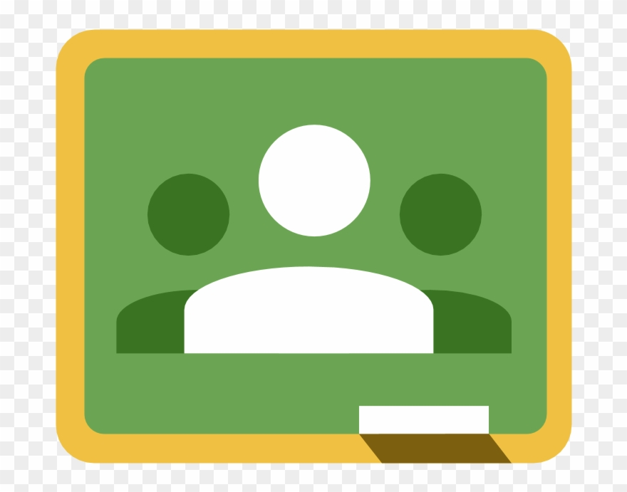

# Google Classroom

* ¿Qué es Classroom? es una aplicación de google pensada para trabajar en centro educativos. Se beneficia de todo el ecosistema de herramientas de google: Gdrive, todos los editores de documentos, hojas de cálculo

* Normalmente se suele llamar Classroom a todo el conjunto de aplicaciones de Google que funcionando integradas permiten trabajar perfectamente online y hacer casi todo lo que solemos hacer en un centro educativo.

¿Necesito tener una cuenta de centro para usarlo?

No es necesario que vuestro centro esté usando GSuite, puedes usarlo con una cuenta de gmail. Pero al usar una cuenta de gmail perdemos la integración con otras herramientas como por ejemplo google meet

Podemos reutilizar cualquier documento que tengamos creado en drive
