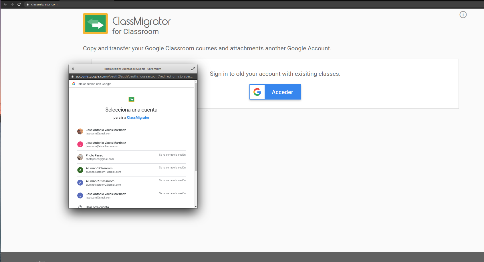
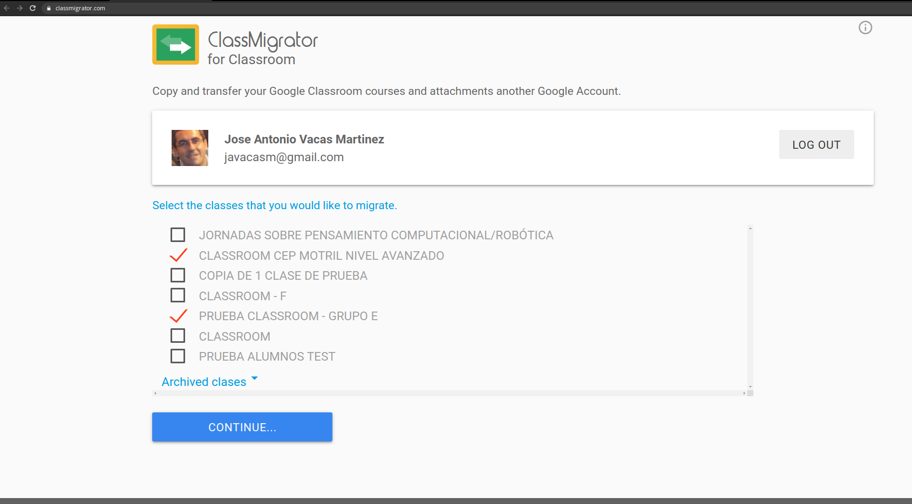
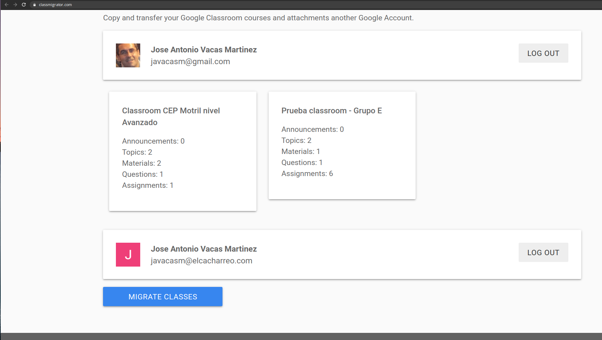
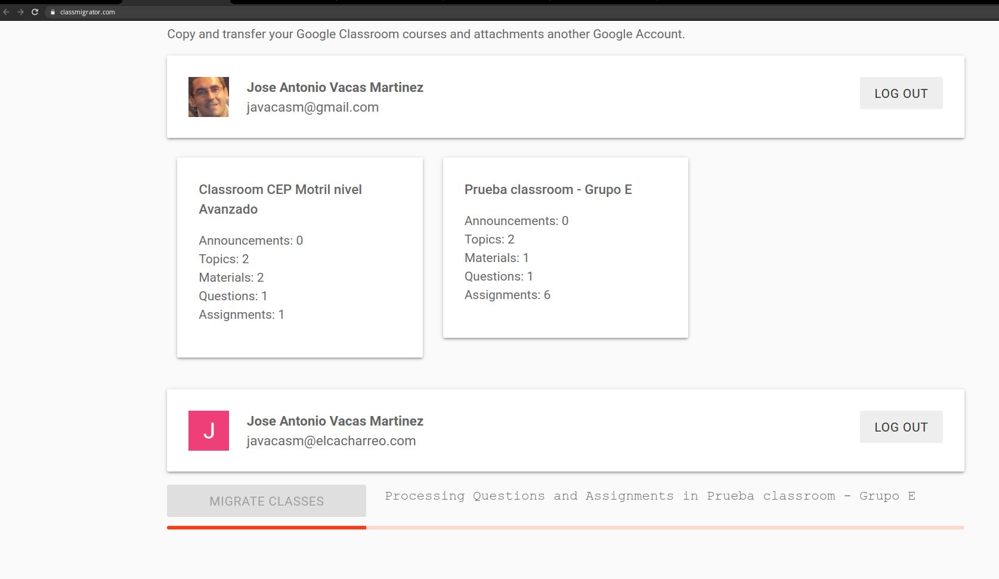
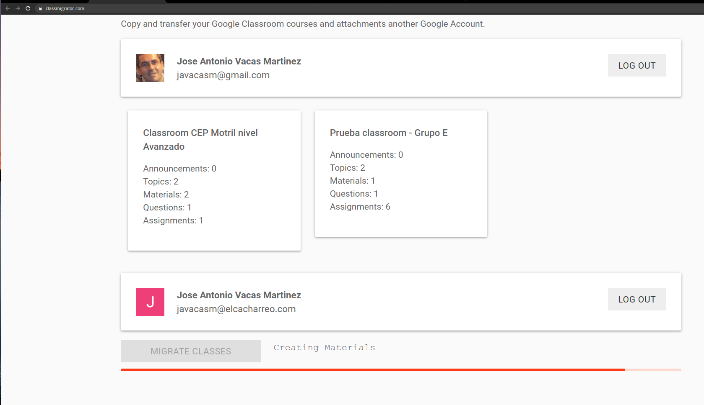
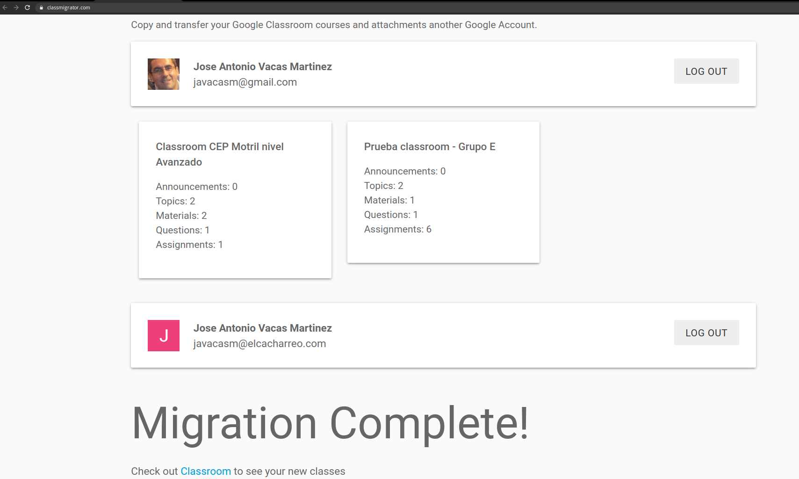

## copia de cuentas y material entre cuentas

## [ClassMigrator](https://classmigrator.com/)

Es una aplicación independiente, y por tanto su uso no está aprobado oficialmente para hacer copia de contenidos de classroom entre diferentes cuentas.

La aplicación copia el contenido desde una **cuenta origen** a una **cuenta destino**, y podemos **seleccionar las clases** que queremos copiar

0. Entramos en [https://classmigrator.com/](https://classmigrator.com/)

1. Seleccionamos la cuenta origen, donde están las cuentas que queremos copiar:

2. Seleccionamos aquellas clases que queremos copiar:

3. Ahora seleccionamos la cuenta destino, donde se copiarán las clases:

4. Pulsamos en "Migrate classes"

5. Va copiando los contenidos

6. Migración terminada

[Video tutorial](https://www.youtube.com/watch?v=eqr8HGlQ3SA)

