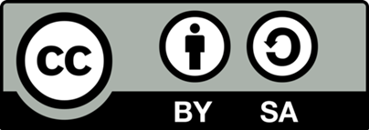

# Curso sobre Google Classroom & GSuite

## Licencia CC

Octubre de 2020

Documentación basada en contenidos propios y en los vídeos de Rubén Lechuga y Antonio Riera para el curso de "Plataformas Educativas" para CEP de Granada

## Índice

0. ¿[Qué es GSuite for Education](./QueEsGSuiteForEdu.md)?
1. [Administración](./Administracion.md):
    * Instalación: dominios
    * Configuración
    * Permisos
1. Herramienta [Classroom](./Classroom.md)
    * [Clases](./Clases.md): creación, copia, archivado
    * [Personas](./Personas.md)
        * Profesores
        * Alumnos: código, enlaces, importación masiva
    * [Trabajo de clase](./TrabajoClase.md): 
        * Temas
        * Tareas
        * Calificaciones
1. Drive
    * Organización del contenido
    * Dónde se guardan las videoconferencias
    * Creación de contenidos
    * Cooperación y documentos colaborativos. Historial y ver qué ha hecho cada usuario 
    * Documentos
    * Hojas de cálculo
    * Presentaciones
1. Meet y JamBoard
    * Videoconferencias: Chats, grabación, compartir pantalla. 
    * Implicaciones legales
    * Problemas más frecuentes
    * Jamboard: clase con dispositivos táctiles.
